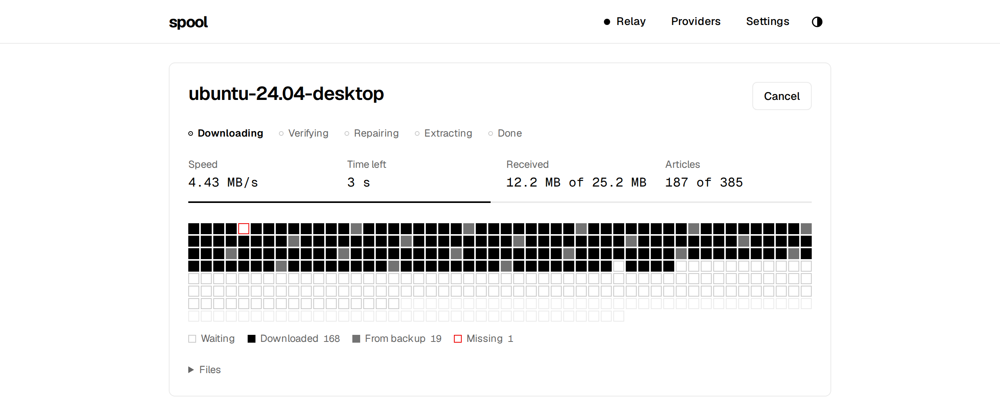
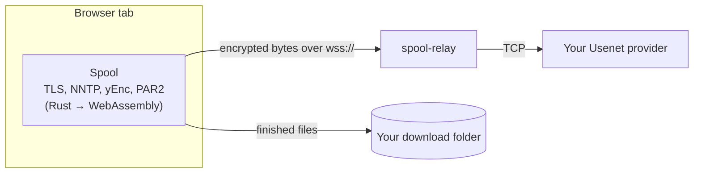

<p align="center">
  <picture>
    <source media="(prefers-color-scheme: dark)" srcset="docs/assets/wordmark-dark.svg" />
    
  </picture>
</p>

<p align="center">Usenet in a browser tab.</p>

<p align="center">
  <a href="https://github.com/mrghxst/spool/actions/workflows/ci.yml"></a>
  <a href="LICENSE"></a>
  <a href="https://github.com/mrghxst/spool/pkgs/container/spool-relay"></a>
</p>

<p align="center">
  <picture>
    <source media="(prefers-color-scheme: dark)" srcset="docs/assets/hero-dark.png" />
    
  </picture>
</p>

Spool downloads files from an `.nzb` straight onto your computer with nothing
to install. Add your Usenet provider, drop in an `.nzb`, pick a folder, and
get the finished files. Downloading, yEnc decoding, PAR2 verification and
repair, and extraction all happen in the browser tab.

**[Open Spool](https://mrghxst.github.io/spool/)**

## How it works

Browsers can't open TCP connections, so a tiny relay forwards WebSocket
traffic to your provider's server. TLS runs inside the browser and ends at
the provider: the relay only ever handles encrypted bytes, so it can't read
your password or what you download. You can run your own relay with one
`docker run`.



More in [docs/architecture.md](docs/architecture.md) and the relay
[protocol](docs/protocol.md).

## Privacy

| Party | Sees | Never sees | Keeps |
| --- | --- | --- | --- |
| Static host (GitHub Pages) | Your IP and the app files you load | Anything you do in the app | Its standard access logs, which Spool doesn't control |
| Relay | Your IP, the provider's hostname, byte counts while connected | Usernames, passwords, message-ids, file names, content | Nothing: no logs, no disk, in-memory counters only |
| Usenet provider | The relay's IP, your account, what you download | Your IP | What any newsreader would leave |
| Your browser | Everything | | Providers and settings, only with "Remember on this device" on |

Details in [docs/privacy.md](docs/privacy.md).

## Features

- Nothing to install: works on locked-down laptops, including school ones.
- Several providers in priority order. Missing articles are retried on the
  next provider; backup providers connect only when needed.
- PAR2 verification and repair, with only as many recovery files downloaded
  as the repair needs. Obfuscated file names are restored from PAR2.
- Extraction of RAR (including multi-volume), 7z (including split
  `.7z.001`) and zip, then cleanup of the parts.
- Writes straight into a folder you choose (Chromium browsers), with segments
  written in place so large files never sit in memory.
- A segment grid that shows every article: done, from a backup, missing, or
  repaired.
- Light and dark themes, keyboard friendly, works down to phone width.
- Installable as an app that opens `.nzb` files.
- No accounts, analytics or third-party requests. "Remember on this device"
  can be turned off for shared computers.

## Run your own relay

A relay on your own computer is the fastest option: downloads go straight
from your provider to your computer, with no server in between.

**Windows or macOS:** download `spool-relay-windows-amd64.exe` (or
`spool-relay-macos-arm64` / `-amd64`) from the
[releases page](https://github.com/mrghxst/spool/releases/latest) and run it.
It listens on this computer only and allows any provider. Then set the relay
in Spool to `ws://localhost:8080`. The binaries aren't code-signed, so Windows
SmartScreen asks first (**More info → Run anyway**); on macOS, right-click it
and choose **Open**.

**Docker:**

```sh
docker run -d --name spool-relay --restart unless-stopped -p 8080:8080 ghcr.io/mrghxst/spool-relay
```

Then open Settings in Spool and set the relay to `ws://localhost:8080`.
Browsers allow `ws://localhost` from an https page, but not `ws://` to
another machine: a relay on a home server or NAS needs HTTPS in front of it
([how](deploy/README.md#on-a-home-server-or-nas)).

To serve it to others with HTTPS, use Docker Compose with Caddy:

```yaml
services:
  relay:
    image: ghcr.io/mrghxst/spool-relay:latest
    restart: unless-stopped
    environment:
      SPOOL_TRUST_PROXY: "1"
  caddy:
    image: caddy:2-alpine
    restart: unless-stopped
    ports: ["80:80", "443:443"]
    volumes:
      - ./Caddyfile:/etc/caddy/Caddyfile:ro
      - caddy_data:/data
volumes:
  caddy_data:
```

```
# Caddyfile. Caddy keeps no access logs unless you add a `log` directive.
relay.example.com {
	reverse_proxy relay:8080
}
```

The full five-minute VPS guide, including DNS and options, is in
[deploy/README.md](deploy/README.md). Static binaries for Linux (amd64,
arm64) are on the [releases page](https://github.com/mrghxst/spool/releases).

## Host the app yourself

The app is static files. GitHub Pages builds it from this repo. To host it on
Cloudflare Workers, connect the repo in Workers Builds with build command
`pnpm run build` and deploy command `npx wrangler deploy`; the build fetches
the Rust toolchain on Cloudflare's builder (about a minute) and
[wrangler.jsonc](wrangler.jsonc) serves `apps/web/dist`. Any other static host
works with the contents of `apps/web/dist` after `pnpm build`.

## Browser support

| Browser | Support |
| --- | --- |
| Chrome, Edge, Brave, Opera, Arc (Chromium) | Full: files are written into the folder you choose |
| Firefox, Safari | Downloads work; files are kept in browser storage until you click **Save files** |

Needs a browser from 2023 or later (WebAssembly SIMD, module workers, the
origin private file system).

## FAQ

**Why is there a relay at all?** Web pages can't open raw TCP connections.
The relay turns a WebSocket into a TCP connection and nothing more. The
browser does the TLS handshake with your provider through it, so the relay
sees only encrypted bytes. The relay also refuses any connection that doesn't
start with a TLS handshake.

**Can the relay operator see my password?** No. Your login happens inside
the TLS session between your browser and the provider.

**Which providers work?** Any provider with TLS on port 563 or 443. The
public relay allows a list of common provider domains; your own relay can
allow anything (`SPOOL_ALLOW=*`).

**Does all my download traffic go through someone's server?** Only if you
use a relay on another machine. Browsers can't open connections to Usenet
servers themselves, so something has to turn a WebSocket into a TCP
connection. Run the relay on your own computer (above) and nothing else is in
the path: the bytes go from your provider to the relay on your machine and
into the tab. A relay on your home server is just as fast over your LAN. The
public relay is for computers where you can't run anything.

**How fast is it?** On a desktop, against a fast relay, about 65 to 75 MB/s
in Chromium. Your connection and your relay's are usually the limit. See
[docs/decisions.md](docs/decisions.md#performance).

**Can I close the tab mid-download?** Not yet. A download needs the tab to
stay open; Spool asks before you leave.

**Encrypted archives?** Spool can't decrypt RAR or encrypted 7z/zip in the
browser. It keeps the archive files and shows the password from the NZB, so
you can extract them with a desktop tool.

**Where are my settings stored?** In this browser's IndexedDB, and only if
"Remember on this device" is on. Settings has "Forget everything".

## Development

You need Rust (with the `wasm32-unknown-unknown` target), `wasm-bindgen-cli`
0.2.129, binaryen (`wasm-opt`), clang, Node 22 and pnpm.

```sh
pnpm install
pnpm build:wasm        # the Rust engine → apps/web/src/lib/engine/pkg
pnpm dev               # the app on http://localhost:5173
cargo test --workspace # engine, relay and mock server tests
pnpm test              # web unit tests
pnpm e2e               # Playwright against mock-nntp and the relay (needs par2, 7z)
```

`bash e2e/run.sh --serve` starts the mock providers, a relay and a test build
for manual testing. `--perf` runs the throughput benchmark and `--screens`
captures every screen in both themes.

| Path | What |
| --- | --- |
| `apps/web` | The Svelte app and its workers |
| `crates/engine` | Sans-IO Rust: TLS, NNTP, yEnc, NZB, PAR2 |
| `crates/relay` | spool-relay |
| `tools/mock-nntp` | TLS NNTP server and NZB generator for tests |
| `tools/archive-wasm` | The libarchive shim built by `scripts/build-libarchive.sh` |
| `e2e` | Playwright tests |
| `deploy` | Compose file, Caddyfile and the VPS guide |
| `docs` | Architecture, protocol, privacy and design decisions |

See [CONTRIBUTING.md](CONTRIBUTING.md) and [SECURITY.md](SECURITY.md).

## License

[MIT](LICENSE). The bundled libarchive, liblzma, zlib and bzip2 are under their
own permissive licenses ([list](apps/web/src/lib/archive/vendor/LICENSES.md)),
and the Geist fonts under the SIL Open Font License.

Spool is an NNTP client. You are responsible for what you download and for
following your provider's terms.
