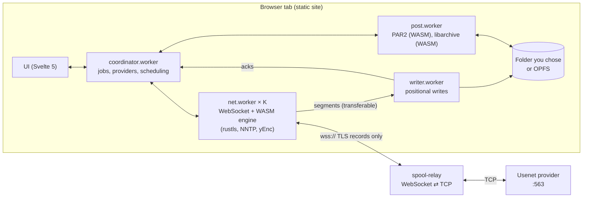

# Architecture

## Moving parts

- **UI** (`apps/web/src`): Svelte 5 with runes, no SvelteKit. It creates the
  workers on first use and wires them together with `MessageChannel`s.
- **coordinator.worker**: parses the NZB (Rust `quick-xml` via WASM), plans
  the download, opens connections on the net workers, hands each connection a
  window of requests, routes missing articles to the next provider, closes
  finished files, and runs verification, repair and extraction through the
  post worker.
- **net.worker × K** (K = `min(hardwareConcurrency, 4)`): each holds several
  connections. A connection is a WebSocket to the relay plus a sans-IO `Conn`
  from the engine: ciphertext in, ciphertext out, NNTP events up. Decoded
  segments go straight to the writer as transferable `ArrayBuffer`s.
- **writer.worker**: writes each segment at its yEnc offset. Chromium uses the
  folder you picked (`createWritable({ keepExistingData: true })`, one stream
  per file); other browsers use OPFS with `createSyncAccessHandle()`.
- **post.worker**: PAR2 verification and Reed-Solomon repair (Rust/WASM),
  deobfuscation, extraction with libarchive (WASM, loaded only when needed),
  and cleanup.

## The engine (`crates/engine`)

Sans-IO Rust that never touches sockets or files, so it runs the same way in
`cargo test` (against `tools/mock-nntp`) and in the browser.

| Module | Job |
| --- | --- |
| `tls` | rustls client config: Mozilla roots (webpki-roots), a `Date.now()` clock, ChaCha20-Poly1305 first |
| `nntp` | Read-only command whitelist, pipelined request queue (8 in flight), response parser that handles any input split |
| `conn` | TLS + NNTP glued together: `on_bytes`, `take_outgoing`, `request`, `poll_event` |
| `yenc` | Decoder with SWAR and simd128 fast paths, CRC32 check, encoder for tests |
| `nzb` | NZB parsing, filename extraction, file classification |
| `par2`, `gf16` | PAR2 2.0 packets, streaming verification, Reed-Solomon over GF(2^16) |
| `wasm` | wasm-bindgen bindings |

Only `AUTHINFO`, `BODY`, `STAT`, `DATE`, `CAPABILITIES` and `QUIT` can be
sent. The `Command` enum has no other variants, and every encoded line passes
`nntp::check_line` before it's queued. Tests drive whole sessions and check
every byte written.

## A download, step by step

1. The coordinator orders files: the smallest `.par2` index first, then the
   files you ticked. Recovery volumes wait.
2. Providers that aren't backups share the queue. Each connection gets up to
   16 requests; the engine keeps 8 on the wire.
3. `430` (no such article) or a CRC mismatch sends the article to the next
   provider in your list that hasn't tried it, backups included. Backups
   connect only when the first article is routed to them. When every provider
   has tried, the article is marked missing for PAR2.
4. `400`/`502` lowers that provider's connection count and backs off. A login
   failure disables the provider for the job and shows the reason.
5. When a file's articles are all written or missing, the writer truncates it
   to the yEnc size, closes it and renames it to the yEnc name.
6. The post worker matches files to the PAR2 set (renaming obfuscated files by
   the MD5 of their first 16 KiB, or by length), verifies them, and reports
   how many blocks repair needs. The coordinator then fetches only enough
   recovery volumes to cover that, and the post worker repairs.
7. Archive sets (`.partNN.rar`, `.rar`/`.r00`, `.7z.001`, `.7z`, `.zip`) are
   extracted, then archive parts and PAR2 files are removed if cleanup is on.

## Performance

The engine is the only CPU-heavy part: TLS decryption, yEnc decoding and CRC
checks run in WASM inside the net workers, MD5 and Reed-Solomon in the post
worker. Nothing uses `SharedArrayBuffer` (GitHub Pages can't send COOP/COEP
headers); data moves between workers as transferable buffers.

Measured with `bash e2e/run.sh --perf` (256 MB, 700 KB articles, 16
connections, mock server and relay on the same machine, headless Chromium):
65 to 75 MB/s. See [decisions.md](decisions.md#performance) for the numbers
and where the ceiling is.
